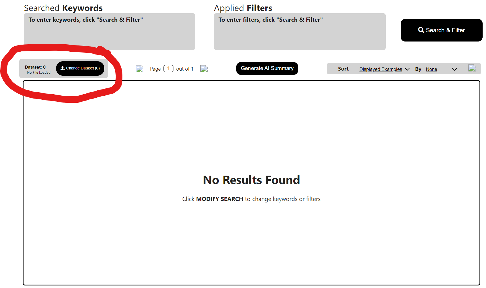
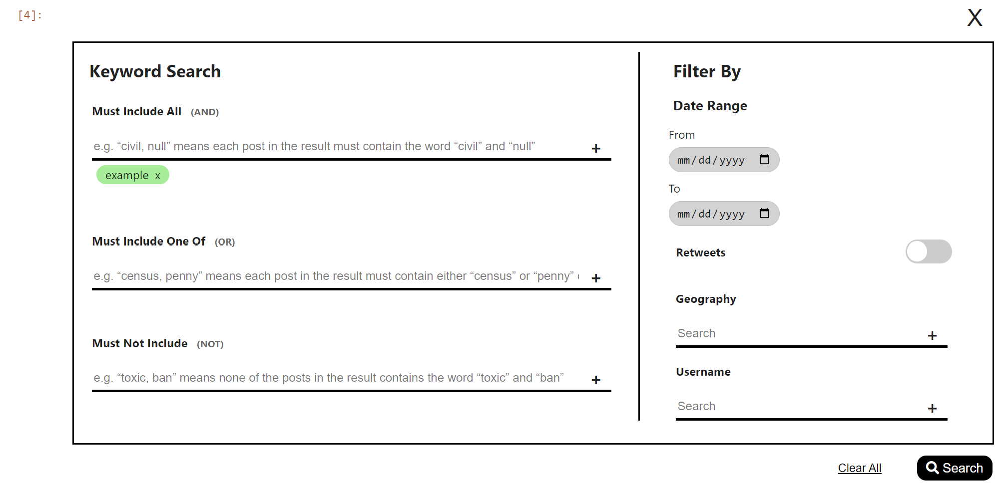
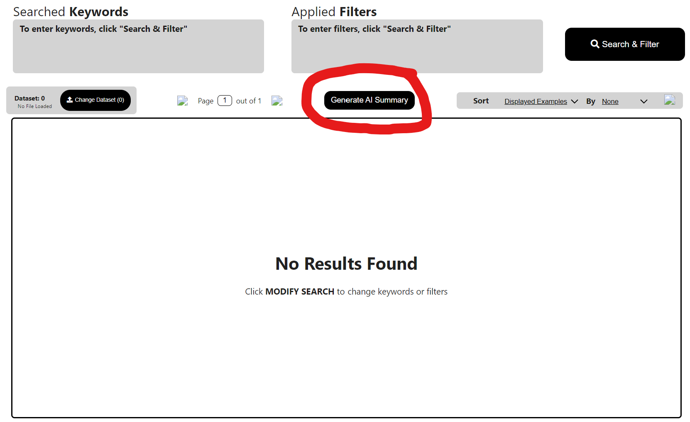

# Tweet Browser
A simple WIP browser for analyzing Tweets and other social media datasets in .csv form written in Jupyter Notebook. Tweet Browser **does not** contain any features to scrape or generate data, so you must supply your own dataset. Key features include:

 - AI generated summaries
 - Keyword searches and filters
 - Search result and dataset sorting
 
Currently supported filter options are:
 - Keyword inclusion and exclusion
 - Date ranges
 - Location
 - Username
 - Retweet toggle
 

## Installation Instructions

First make sure that Jupyter Notebook is installed. To install Jupyter Notebook, open Python or the shell of your choice and run the command `pip install notebook`

Then run this command to install all of the required dependencies:
`pip install pandas scikit-learn umap-learn hdbscan leidenalg voila ipywidgets anywidget`

Now clone the repository with 

    git clone https://github.com/Erikzhou2021/Tweet_browser.git
You  should be able to open the project by using the command `jupyter notebook` in the Tweet_browser directory.
## Data Format
Tweet Browser currently only supports analyzing [.csv](https://en.wikipedia.org/wiki/Comma-separated_values) files. We recommend [Sprinklr](https://www.sprinklr.com/), but your dataset can come from any source as long as each entry follows the format in the below table. The browser will open the file called allCensus_sample.csv in the `Frontend` directory by default, but you can select another file later. The .csv should have the following format:
| UniversalMessageId | SocialNetwork | SenderUserId | SenderScreenName | SenderListedName | SenderProfileImgUrl | SenderProfileLink | SenderFollowersCount | SenderInfluencerScore | SenderAge | SenderGender | OriginalAuthor | OriginalAuthorProfileLink | Title | Message | MessageType | CreatedTime | Language | LanguageCode | CountryCode | MediaTypeList | Permalink | Domain | Retweets |
|-|-|-|-|-|-|-|-|-|-|-|-|-|-|-|-|-|-|-|-|-|-|-|-|

Not every field is required, so feel free to exclude unnecessary fields.
## Quickstart Guide
### Selecting a dataset
Click the "Change Dataset" button above the results box on the left.

### Setting filter parameters
To change search parameters, first click the Search & Filter button in the top right corner of the dashboard, which should bring up this menu.

You can add keywords to any of the text fields by typing in them and pressing Enter or the plus icon. For date ranges, click on the calendar icon to select dates. Make sure to press the search button on the bottom right to apply your changes. To exit without saving, click the X icon on the top right.

### Generating a summary
Click the "Generate AI summary" button above the results box.
